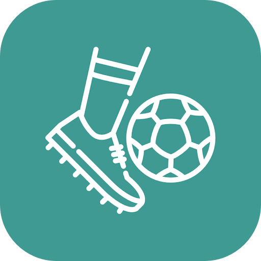
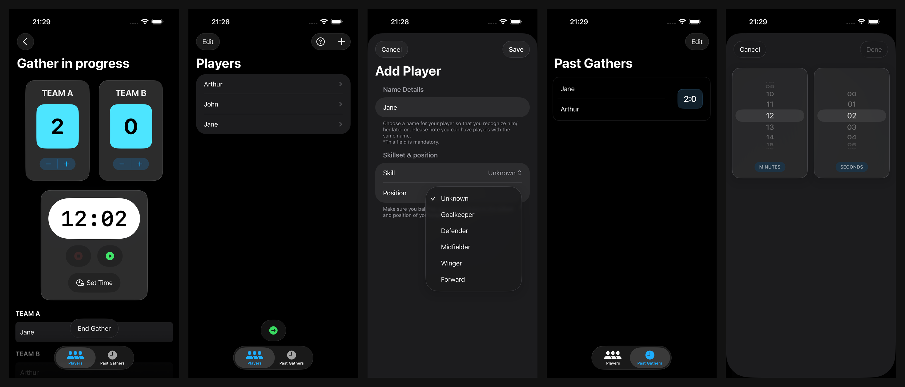
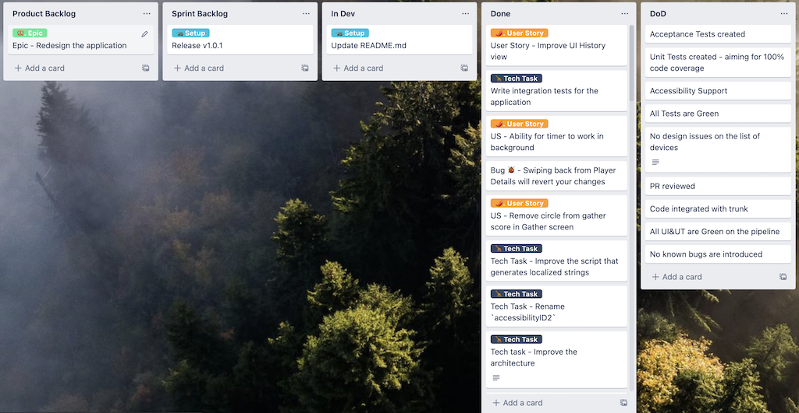
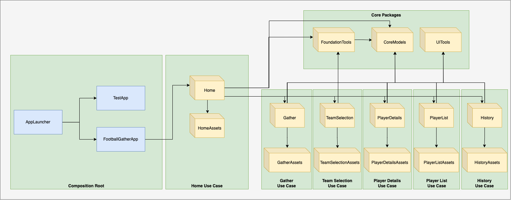

# 📱 Football Gather App

<p align="center">
    
</p>
<p align="center">
    <a href="https://swift.org"></a>
    <a href="https://developer.apple.com/xcode/"></a>
</p>

## ⬇️ Download

<p>

[](https://apps.apple.com/ro/app/football-gather/id1607436439)

</p>

<p>

[](https://play.google.com/store/apps/details?id=com.rdan.footballgather)

</p>

### Official Website
Visit our website at [footballgather.app](https://footballgather.app/) for more information.

## 🛠️ Requirements

- minimum iOS 18.0

## 🔧 Tools

- Xcode & Swift for development - https://developer.apple.com/xcode/
- Swift Package Manager for modularization - https://www.swift.org/package-manager/
- GitHub Actions for CI/CD pipelines - https://docs.github.com/en/actions
- fastlane for automating CI & distribution to TestFlight - https://fastlane.tools/
- Bundler to execute fastlane commands - https://bundler.io/

## 📖 Usage

Clone the repository and ensure you have the correct Xcode version installed:  
`git clone https://github.com/radude89/footballgather-prod.git`

### 🚀 Running the App

1. Open the project in Xcode:
   ```
   open FootballGather.xcodeproj
   ```
2. Select a simulator or connected device from the scheme menu in Xcode's toolbar
3. Select the `FootballGather` scheme
4. Click the Run button (▶️) or press `Cmd + R` to build and run the app

### 🧪 Running Tests

To run the project or unit tests, use the `FootballGather` scheme:
1. Select Product > Test from the menu bar, or
2. Press `Cmd + U` to run the tests

To run the UI tests, use the `UITests` scheme:
1. Select the `UITests` scheme from the scheme menu
2. Select Product > Test from the menu bar, or
3. Press `Cmd + U` to run the UI tests

### 🤖 Using Fastlane

For fastlane usage, please <a href="FootballGather/fastlane/README.md">refer to this guide</a>. Available commands:  
```
# Running unit tests
bundle exec fastlane ios ut

# Running UI tests
bundle exec fastlane ios ui

# Taking snapshots
bundle exec fastlane screenshots

# Bumping versions
bundle exec fastlane bump_versions
```

## 📱 Screens

<p align="center">
    
</p>

## 🎮 Demo

<p align="center">
    
</p>

## 📝 Application Summary

Football Gather helps you record and track matches that you play with your friends. 

Key features:
- Player management
- Customizable match countdown timer
- Score tracking
- Match history

## 📚 Blog Articles

Article series - **Battle of the iOS Architecture Patterns**:
- Model View Controller (MVC) - <a href="https://medium.com/p/442241b447f6">medium article here</a> or on <a href="https://radude89.com/blog/mvc.html">my personal blog</a>.
- A Look at Model-View-ViewModel (MVVM) - <a href="https://medium.com/p/bdfd07d9395e">medium article here</a> or on <a href="https://radude89.com/blog/mvvm.html">my personal blog</a>.
- Model View Presenter (MVP) - <a href="https://medium.com/p/f693f6efd23e">medium article here</a> or on <a href="https://radude89.com/blog/mvp.html">my personal blog</a>.
- Model View Presenter with Coordinators (MVP-C) - <a href="https://medium.com/p/99edf7ab8c36">medium article here</a> or on <a href="https://radude89.com/blog/mvp-c.html">my personal blog</a>.
- View Interactor Presenter Entity Router (VIPER) - <a href="https://medium.com/p/8f76f1bdc960">medium article here</a> or on <a href="https://radude89.com/blog/viper.html">my personal blog</a>.
- View Interactor Presenter (VIP) - <a href="https://medium.com/p/59ebdae86e84">medium article here</a> or on <a href="https://radude89.com/blog/vip.html">my personal blog</a>.

Other connected articles:
- Using Vapor 3 and Fluent to create a REST API - <a href="https://medium.com/p/5f9a0dcffc7b">medium article here</a> or on <a href="https://radude89.com/blog/vapor.html"> my personal blog</a>.
- Migrating to Vapor 4 - <a href="https://medium.com/p/53a821c29203">medium article here</a> or on <a href="https://radude89.com/blog/migrate-to-vapor4.html"> my personal blog</a>.

## ✅ Definition of Done

- Acceptance Tests created.
- Unit Tests created - aiming for 100% code coverage.
- Integration Tests created where needed.
- UI tests for core journeys.
- Accessibility support.
- Dark mode support.
- All tests are green locally.
- Code integrated with `main`.
- All tests are green on the CI tool.
- No known bugs are introduced into the product.
- No design / UI issues are introduced into the product.

## 📋 Kanban Board

All stories and the product backlog can be seen publicly here: https://trello.com/b/UTfCqxBK/football-gather.

<p align="center">
    
</p>

## 📘 Technical Notes

The architecture is modular and leverages Swift packages. The UI implementation uses MVVM architecture pattern with SwiftUI.  
We adhere to the following engineering principles and best practices:

### 🏗️ App Structure

The app consists of the following components:
* **App** - Contains the entry point of Football Gather and the `WindowGroup` that houses the `MainView`. It depends on the `Home` module.
* **Core Packages** - Foundation modules with no dependencies: `FoundationTools`, `UITools`, and `CoreModels`.
* **Use Cases** - Independent feature modules that implement the application's functionality.

Below, we present the high-level diagram of the project's packages:

<p align="center">
    
</p>

Notes:
- **Composition root**: app launch logic and the place where the dependencies are created.
  - **AppLauncher**: main function of the app, checks if the app has been ran from the test target or from the app target and initializes the `App` object.
  - **FootballGatherApp**: the app structure, that is implementing the `SwiftUI` protocol `App`. This is a type that represents the structure and behavior of the app.'
  - **TestApp**: a simplified version of the UI that is used when running test targets.
- **Home Use Case**: contains the `Home` screen logic.
- **Gather Use Case**: the main package of the application, that has the timer and score handling.
- **TeamSelection Use Case**: this is the place where we select players and assign them teams.
- **PlayerDetails Use Case**: we have here the information about the player, such as name, age or position.
- **PlayerList Use Case**: represents the list of players.
- **History Use Case**: your previous played gathers.
- **Core Packages**: the tools for the project, having a lot of packages that depend on them.
  - **FoundationTools**: contains the core utils, helpers, extensions files.
  - **UITools**: is the package containing the helper files related to the application's UI.
  - **CoreModels**: this package contains the domain models of the app.

### 🔑 Key Technical Decisions

1. SwiftUI for user interface implementation
  - Chosen to gain practical experience with the framework in a production environment
2. MVVM architecture pattern for UI implementation
  - Natural integration with SwiftUI
3. UIKit implementation for player selection
  - Implemented due to SwiftUI limitations with drag & drop functionality in multi-sectioned Lists

### 🧪 Testing approach

We use unit tests, integration tests and UI tests.  

Snippets from **April, 2022**:

#### Test Distribution

| Test Type | Count |
|-----------|-------|
| Unit Tests | 301 |
| Integration Tests | 51 |
| UI Tests | 26 |
| **Total** | **378** |

#### Code Coverage

| Package | Coverage | Executable Lines |
|---------|----------|-----------------|
| **Core Packages** | | |
| CoreModels | 100% | 23 |
| FoundationTools | 100% | 278 |
| **Use Cases** | | |
| TeamSelection | 94.86% | 175 |
| Gather | 99.18% | 486 |
| History | 100% | 93 |
| PlayerList | 100% | 149 |
| PlayerDetails | 100% | 88 |
| Home | 100% | 11 |

> Note: Coverage metrics include only business logic files, excluding views.

## 🤝 Contributions & Support

Football Gather is developed as an open source project. I encourage everyone to contribute.   
Please do make pull requests if you have suggestions or ideas of improvement.   
Thanks!

## 👨‍💻 About the Author

Hi! I'm **Radu Dan**, a Staff iOS Engineer with over 13 years of experience in mobile development. I'm passionate about crafting high-quality iOS applications and sharing knowledge with the developer community.

### 🎯 Professional Background
- Currently Staff iOS Engineer at Qonto
- Previously Mobile Lead at Deloitte Digital Romania
- Over 6 years of experience in fintech projects

### 🚀 Other Apps
Besides Football Gather, I've developed several other indie apps:
- [CarChum](https://apps.apple.com/us/app/carchum/id6465991938) - Your friendly vehicle helper
- [n0chanc3](https://apps.apple.com/us/app/n0chanc3/id6742768684) - A visually engaging word puzzle game

### 📱 Connect With Me
- Personal Website: [radude89.com](https://www.radude89.com)
- LinkedIn: [Radu Dan](https://www.linkedin.com/in/radu-dan-b0182349/)
- Email: rdan.dev@gmail.com

## 📄 License

Football Gather source code is released under the MIT license. [See LICENSE](https://github.com/radude89/footballgather-prod/blob/main/LICENSE) for details.
