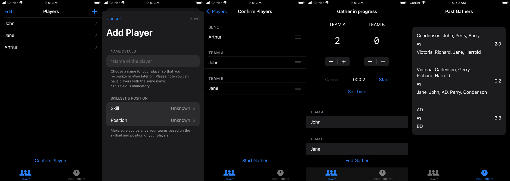

# FootballGather

<p align="center">
    
</p>
<p align="center">
    <a href="https://swift.org"></a>
    <a href="https://developer.apple.com/xcode/"></a>
</p>

## Requirements

- iOS 15.0+
- iPadOS 15.0+

## Tools

- Xcode & Swift 5.5 to develop the project - https://developer.apple.com/xcode/
- Swift Package Manager for modularisation - https://www.swift.org/package-manager/
- GitHub Actions for the CI/CD pipelines - https://docs.github.com/en/actions
- fastlane for automating CI & distribution to TestFlight - https://fastlane.tools/
- Bundler to execute the fastlane commands - https://bundler.io/

## Usage

The project can be cloned from the repository. Make sure you use the correct Xcode version.  
`git clone https://github.com/radude89/footballgather-prod.git`

To run the project or unit tests, use the `FootballGather` scheme.   
To run the UI tests, use `UITests` scheme.

If you want to use fastlane, make sure you <a href="FootballGather/fastlane/README.md">read this</a>. The commands are:  
```
# Running the unit tests
bundle exec fastlane ios ut

# Running the UI tests
bundle exec fastlane ios ui
```

## App Store

Link here: https://apps.apple.com/ro/app/football-gather/id1607436439.

## Screens

<p align="center">
    
</p>

## Demo

<p align="center">
    
</p>

## Application Summary

<p>Football Gather is your way to record matches that you play against your friends.</p>
<p>Do you want to track the football matches that you play with your friends in an app? Football Gather is your way to go!</p>

Available features:
- Ability to add players
- Set countdown timer for matches
- Manage your score
- View your past gathers

## Blog Articles

Article series - **Battle of the iOS Architecture Patterns**:
- Model View Controller (MVC) - <a href="https://medium.com/p/442241b447f6">medium article here</a> or on <a href="https://radude89.com/blog/mvc.html">my personal blog</a>.
- A Look at Model-View-ViewModel (MVVM) - <a href="https://medium.com/p/bdfd07d9395e">medium article here</a> or on <a href="https://radude89.com/blog/mvvm.html">my personal blog</a>.
- Model View Presenter (MVP) - <a href="https://medium.com/p/f693f6efd23e">medium article here</a> or on <a href="https://radude89.com/blog/mvp.html">my personal blog</a>.
- Model View Presenter with Coordinators (MVP-C) - <a href="https://medium.com/p/99edf7ab8c36">medium article here</a> or on <a href="https://radude89.com/blog/mvp-c.html">my personal blog</a>.
- View Interactor Presenter Entity Router (VIPER) - <a href="https://medium.com/p/8f76f1bdc960">medium article here</a> or on <a href="https://radude89.com/blog/viper.html">my personal blog</a>.
- View Interactor Presenter (VIP) - <a href="https://medium.com/p/59ebdae86e84">medium article here</a> or on <a href="https://radude89.com/blog/vip.html">my personal blog</a>.

Other connected articles:
- Using Vapor 3 and Fluent to create a REST API - <a href="https://medium.com/p/5f9a0dcffc7b">medium article here</a> or on <a href="https://radude89.com/blog/vapor.html"> my personal blog</a>.
- Migrating to Vapor 4 - <a href="https://medium.com/p/53a821c29203">medium article here</a> or on <a href="https://radude89.com/blog/migrate-to-vapor4.html"> my personal blog</a>.

## Definition of Done

- Acceptance Tests created.
- Unit Tests created - aiming for 100% code coverage.
- Integration Tests created where needed.
- UI tests for core journeys.
- Accessibility support.
- Dark mode support.
- All tests are green locally.
- Code integrated with `main`.
- All tests are green on the CI tool.
- No known bugs are introduced into the product.
- No design / UI issues are introduced into the product.

## Kanban Board

All stories and the product backlog can be seen publicly here: https://trello.com/b/UTfCqxBK/football-gather.

<p align="center">
    
</p>

## Technical Notes

The architecture is modular and uses Swift packages. For the UI implementation, we used MVVM and SwiftUI.  
We believe in the following engineering principles and best practices:

### SOLID Principles

> * **Single Responsibility Principle**: a class should have one, and only one, reason to change. Or the new version: a module should be responsible to one, and only one, actor.
> * **Open-Closed Principle**: a class should be open for extension but closed for modification.
> * **Liskov’s Substitution Principle**: objects in a program should be replaceable with instances of their subtypes without altering the correctness of that program.
> * **Interface Segregation Principle**: many client-specific interfaces are better than one general-purpose interface.
> * **Dependency Inversion Principle**: one should depend upon abstractions, not concretions.

### Component Cohesion Principles

> * **Reuse/Release Equivalence Principle**: classes and modules (i.e. a component) reused together should be released together.
> * **Common Closure Principle**: classes that change together should be grouped together, and vice versa. The single responsibility principle at component-level.
> * **Common Reuse Principle**: don’t force users of a component to depend on things they don’t need. The interface segregation principle at component-level.

### Component Coupling Principles

> * **Acyclic Dependencies Principle**: no cycle in the dependency graph. Cycles couple components and, among other things, force them to be to released together. Use the dependency inversion principle to break cycles.
> * **The Stable Dependency Principle**: less stable components should depend on more stable components. Depend in the direction of stability.
> * **Stable Abstractions Principle**: stable components should be abstract, and vice versa. An example of an abstract stable component is a high-level policy which is changed by extension following the open-closed principle.

Sources:
* https://clevercoder.net/2018/09/08/clean-architecture-summary-review/.
* https://blog.cleancoder.com/uncle-bob/2012/08/13/the-clean-architecture.html.
* <a href="https://www.amazon.co.uk/Clean-Architecture-Craftsmans-Software-Structure/dp/0134494164/ref=sr_1_1?crid=10IJB97O89XTI&keywords=clean+architecture&qid=1648092747&s=books&sprefix=clean+architecture%2Cstripbooks%2C103&sr=1-1">Clean Architecture book</a>.

### App Structure

The app consists of the following groups:
* **App** - contains the entry point of the FootballGather and the `WindowGroup` that contains the `MainView`. It depends on the `Home` module.
* **Core Packages** - the modules that don't depend on anything: `FoundationTools`, `UITools` and `CoreModels`.
* **Use Cases** - these are the features of the application and are independent from one another.

Below, we present the high-level diagram of the project's packages:

<p align="center">
    
</p>

Notes:
- **Composition root**: app launch logic and the place where the dependencies are created.
  - **AppLauncher**: main function of the app, checks if the app has been ran from the test target or from the app target and initializes the `App` object.
  - **FootballGatherApp**: the app structure, that is implementing the `SwiftUI` protocol `App`. This is a type that represents the structure and behavior of the app.'
  - **TestApp**: a simplified version of the UI that is used when running test targets.
- **Home Use Case**: contains the `Home` screen logic.
- **Gather Use Case**: the main package of the application, that has the timer and score handling.
- **TeamSelection Use Case**: this is the place where we select players and assign them teams.
- **PlayerDetails Use Case**: we have here the information about the player, such as name, age or position.
- **PlayerList Use Case**: represents the list of players.
- **History Use Case**: your previous played gathers.
- **Core Packages**: the tools for the project, having a lot of packages that depend on them.
  - **FoundationTools**: contains the core utils, helpers, extensions files.
  - **UITools**: is the package containing the helper files related to the application's UI.
  - **CoreModels**: this package contains the domain models of the app.

### Key Tech Decisions

1. Using `SwiftUI` to implement the user interface.
  - For learning purposes, I wanted to get a look & feel of the framework on a real application.
2. iOS 15 as the minimum version of the app.
  - To support the newest Apple APIs.
3. Using MVVM for the UI implementation.
  - Works natural with SwiftUI.
4. Implementing the players selection with `UIKit`.
  - Due to a limitation of SwiftUI to drag & drop rows in a multi-sectioned `List`, I took the decision to use `UIKit`.

### Testing approach

We use unit tests, integration tests and UI tests.  

Snippets from **April, 2022**:
- Total number of tests: **378**.
  - Number of UT: **301**.
  - Number of Integration Tests: **51**.
  - Number of UI tests: **26**.
- Code Coverage for unit and integration tests (just business logic files, without views)
  - Core packages:
    - CoreModels: **100%**, executable lines: **23**.
    - FoundationTools: **100%**, executable lines: **278**.
  - Use cases:
    - TeamSelection: **94,86%**, executable lines: **175**.
    - Gather: **99,18%**, executable lines: **486**.
    - History: **100%**, executable lines: **93**.
    - PlayerList: **100%**, executable lines: **149**.
    - PlayerDetails: **100%**, executable lines: **88**.
    - Home: **100%**, executable lines: **11**.

## Contributions & Support

FootballGather is developed as an open source project. I encourage everyone to contribute.   
Please do make pull requests if you have suggestions or ideas of improvement.   
Thanks!

## License

FootballGather source code is released under the MIT license. [See LICENSE](https://github.com/radude89/footballgather-prod/blob/main/LICENSE) for details.
